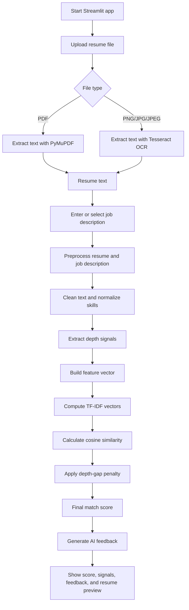

# Resume Matcher

Resume Matcher is a Python and Streamlit app that compares a candidate resume with a job description. It extracts resume text from PDF or image files, cleans and normalizes both texts, calculates a match score, and generates practical AI feedback about missing skills and improvement areas.

## What We Built

- A Streamlit web app for uploading resumes and entering/selecting a job description.
- Resume text extraction for PDF files using PyMuPDF.
- Resume text extraction for image files using Tesseract OCR.
- A preprocessing pipeline that cleans noisy resume/job-description text and normalizes common tech terms.
- A scoring model that uses TF-IDF cosine similarity and a skill-depth gap penalty.
- AI feedback generation through configurable LLM providers such as Groq, Gemini, or OpenRouter.
- Simple test/demo scripts for preprocessing, PDF extraction, and model scoring.

## Project Structure

```text
resume_project/
├── app.py                         # Main Streamlit web application
├── main.py                        # CLI version for PDF resume matching
├── model/
│   └── model.py                   # TF-IDF similarity and final score logic
├── preprocessing/
│   └── preprocessing_pipeline.py  # Text cleaning, skill normalization, depth signals
├── utils/
│   ├── file_extractor.py          # PDF and image text extraction
│   └── llm_helper.py              # AI feedback provider integration
├── dataset/                       # Dataset generation/example files
├── test_preprocessing.py          # Preprocessing demo/test
├── test_model.py                  # Similarity demo/test
├── test_pdf.py                    # PDF extraction demo/test
└── test_image.py                  # Image extraction demo/test
```

## How The Code Works

1. The user opens the Streamlit app from `app.py`.
2. The user uploads a resume file as a PDF, PNG, JPG, or JPEG.
3. The user selects a predefined role template or writes a custom job description.
4. `utils/file_extractor.py` extracts text from the uploaded resume:
   - PDF resumes use `fitz` from PyMuPDF.
   - Image resumes use `pytesseract` with Pillow.
5. `preprocessing/preprocessing_pipeline.py` cleans both resume text and job description text.
6. The preprocessing pipeline:
   - lowercases text and normalizes Unicode,
   - replaces resume delimiters like pipes, bullets, dashes, and slashes,
   - expands informal words and common abbreviations,
   - fixes broken technical words such as `rea ct` to `react`,
   - removes noisy punctuation and extra whitespace,
   - normalizes skill names such as `react.js` to `react`,
   - removes lightweight stopwords,
   - extracts depth signals like `basic`, `experienced`, `advanced`, and `expert`.
7. `build_feature_vector()` returns cleaned text plus depth metadata for both inputs.
8. `model/model.py` converts the cleaned resume and job description into TF-IDF vectors.
9. The model calculates cosine similarity between both vectors.
10. `compute_final_score()` subtracts a small penalty when resume skill depth does not match job-description depth.
11. `utils/llm_helper.py` sends the resume, job description, and score to the configured LLM provider.
12. The Streamlit UI displays the final score, similarity score, depth gap, detected signals, AI feedback, and extracted resume preview.

## Flow Chart



## Scoring Logic

The model compares the cleaned resume and job description using TF-IDF cosine similarity.

```python
similarity = cosine_similarity(resume_vector, jd_vector)
final_score = similarity - (0.15 * depth_gap)
```

The final score is clamped between `0` and `1`, then converted into a percentage.

- `70%` and above: strong match
- `50%` to `69.99%`: moderate match
- Below `50%`: weak match

## Setup

Create and activate a virtual environment:

```bash
python -m venv .venv
source .venv/bin/activate
```

Install Python dependencies:

```bash
pip install -r requirements.txt
```

For image resume OCR, install Tesseract on your system:

```bash
brew install tesseract
```

## Environment Variables

AI feedback needs at least one provider API key. Add keys in a `.env` file at the project root.

```env
LLM_PROVIDER=groq
GROQ_API_KEY=your_groq_key

# Optional alternatives:
GEMINI_API_KEY=your_gemini_key
OPENROUTER_API_KEY=your_openrouter_key
```

If no valid API key is configured, the matching score still works, but AI feedback will show an error message.

## Run The App

```bash
streamlit run app.py
```

Then open the local Streamlit URL shown in the terminal.

## Run The CLI Version

```bash
python main.py
```

The CLI asks for a PDF path and a job description, then prints the match score, similarity score, depth gap, and detected signals.

## Demo/Test Scripts

```bash
python test_preprocessing.py
python test_model.py
python test_pdf.py
python test_image.py
```

These scripts are lightweight demos for checking individual parts of the project.
