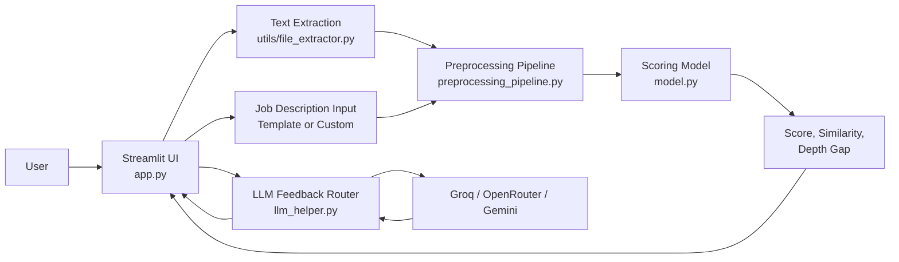
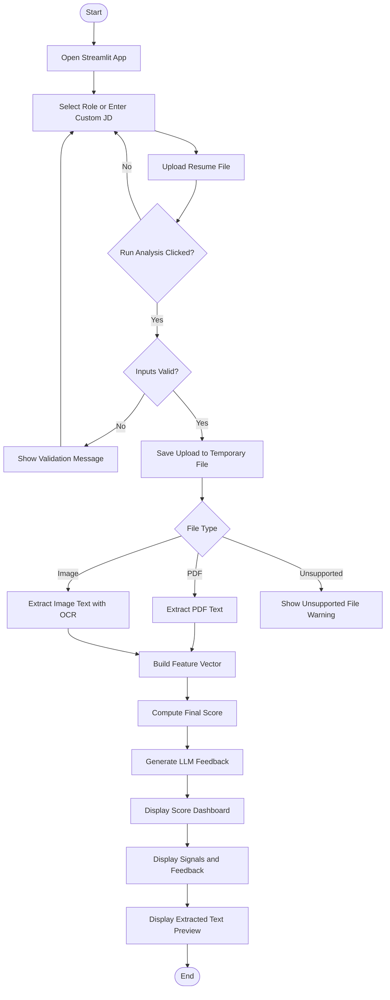
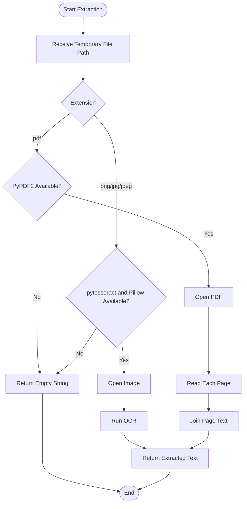
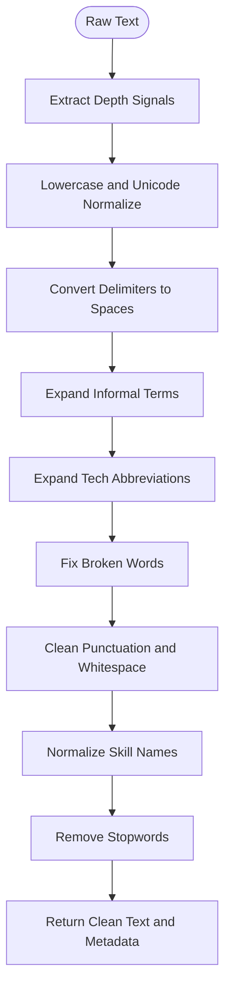
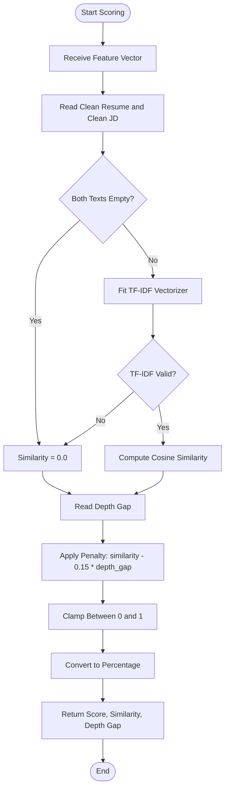
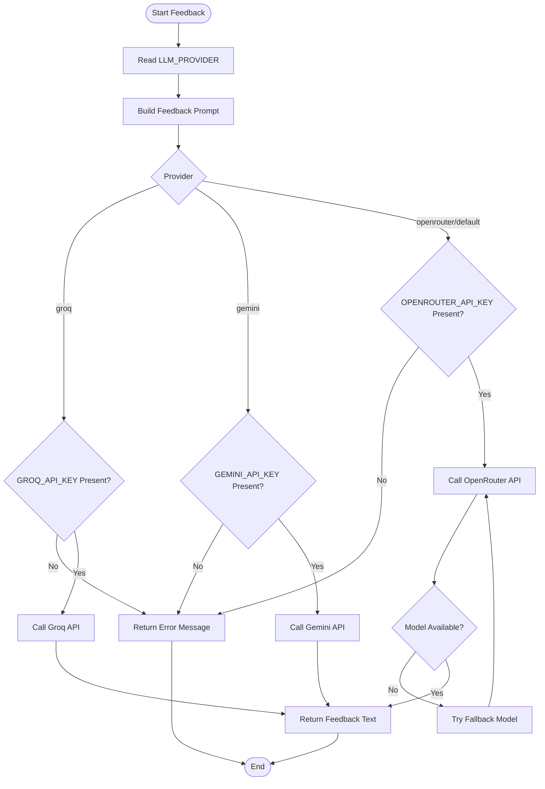
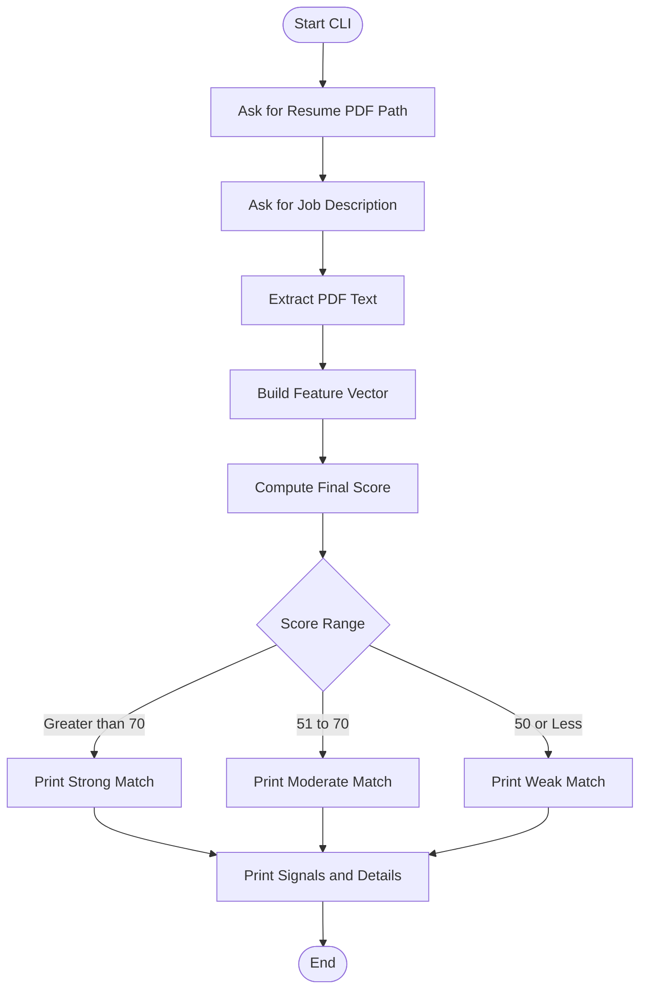

# System Design, Design Notations, Detailed Design, and Flowcharts

## 1. System Design

### 1.1 Project Overview

Resume Matcher is a Python and Streamlit based application that compares a candidate resume with a target job description. The system extracts text from an uploaded resume, preprocesses both resume and job description text, computes a deterministic match score, and optionally generates improvement feedback using an LLM provider.

The system is designed as a modular pipeline so that extraction, preprocessing, scoring, feedback generation, and presentation can evolve independently.

### 1.2 System Goals

- Accept resume input in PDF or image format.
- Accept job description input through role templates or custom text.
- Extract readable text from the uploaded resume.
- Clean and normalize noisy resume and job description text.
- Compute resume-job similarity using TF-IDF and cosine similarity.
- Apply a depth-gap penalty based on skill-depth signals.
- Generate career improvement feedback through Groq, OpenRouter, or Gemini.
- Display the final result in a clear Streamlit dashboard.
- Continue deterministic scoring even when LLM feedback fails.

### 1.3 High-Level Architecture

The application follows a layered architecture:

| Layer | File or Module | Responsibility |
| --- | --- | --- |
| Presentation Layer | `app.py` | Streamlit UI, user inputs, form validation, result display |
| CLI Layer | `main.py` | Simple command-line workflow for PDF resume matching |
| Extraction Layer | `utils/file_extractor.py` | PDF and image text extraction |
| Preprocessing Layer | `preprocessing/preprocessing_pipeline.py` | Text cleanup, skill normalization, depth signal extraction |
| Scoring Layer | `model/model.py` | TF-IDF vectorization, cosine similarity, final score calculation |
| Feedback Layer | `utils/llm_helper.py` | Provider-specific LLM feedback generation and API error handling |
| Test Layer | `test_*.py` | Unit and integration checks for core behavior |

### 1.4 Component Architecture



### 1.5 Data Flow

1. The user uploads a resume file and selects or enters a job description.
2. The application saves the uploaded file temporarily.
3. The extraction layer converts the resume file into plain text.
4. The preprocessing layer cleans resume text and job description text.
5. The same preprocessing layer extracts skill-depth signals from both texts.
6. The scoring layer computes textual similarity using TF-IDF and cosine similarity.
7. The final score is adjusted using the depth-gap penalty.
8. The feedback layer sends resume text, job description, and score to the configured LLM provider.
9. The UI displays score metrics, signal summaries, extracted text preview, and AI feedback.

### 1.6 System Inputs and Outputs

| Type | Input or Output | Description |
| --- | --- | --- |
| Input | Resume PDF | Parsed using PyPDF2 |
| Input | Resume image | Parsed using pytesseract and Pillow |
| Input | Job description | Selected role template or custom user text |
| Input | Environment variables | LLM provider and API key configuration |
| Output | Final match score | Percentage score clamped between 0 and 100 |
| Output | Similarity score | Raw cosine similarity between cleaned texts |
| Output | Depth gap | Difference between resume and JD depth scores |
| Output | Signal summary | Detected depth indicators such as expert, basic, familiar |
| Output | AI feedback | Provider-generated coaching and improvement suggestions |

### 1.7 Non-Functional Design

| Requirement | Design Response |
| --- | --- |
| Reliability | Recoverable failures return controlled empty strings or `Error:` messages |
| Maintainability | Each major concern is isolated into a separate module |
| Explainability | Score uses visible TF-IDF similarity and explicit depth-gap penalty |
| Extensibility | LLM provider routing supports multiple providers through environment variables |
| Performance | Lightweight preprocessing and two-document TF-IDF are fast for local use |
| Security | API keys are loaded from `.env` and should not be committed |
| Testability | Core functions can be tested independently with pytest |

## 2. Design Notations

The following notations are used to describe the system design and flowcharts.

### 2.1 Flowchart Notations

| Symbol Type | Mermaid Notation | Meaning in This Project |
| --- | --- | --- |
| Terminator | `Start`, `End` nodes | Beginning or end of a workflow |
| Process | Rectangle node | Operation such as extraction, preprocessing, or scoring |
| Input/Output | Parallelogram-style label | User input, uploaded file, displayed result |
| Decision | Diamond node | Conditional branch such as file type or provider selection |
| Connector | Arrow | Direction of control flow or data flow |
| External System | Separate provider node | LLM APIs such as Groq, OpenRouter, Gemini |

### 2.2 Data Flow Diagram Notations

| Notation | Meaning |
| --- | --- |
| External Entity | User or external LLM provider |
| Process | A transformation step such as text extraction or scoring |
| Data Flow | Movement of resume text, job description text, score, or feedback |
| Data Store | Temporary uploaded file or environment configuration |

### 2.3 Module Design Notations

| Notation | Meaning |
| --- | --- |
| Module | Python file or package |
| Function | Callable unit that performs one operation |
| Return Object | Dictionary, string, tuple, or number passed to another layer |
| Error Contract | Controlled fallback output instead of uncaught crash |

### 2.4 Naming Conventions

| Convention | Example | Purpose |
| --- | --- | --- |
| Snake case functions | `compute_final_score` | Python function naming |
| Module folders | `preprocessing`, `utils`, `model` | Logical separation of concerns |
| Environment variables | `LLM_PROVIDER`, `GROQ_API_KEY` | Runtime configuration |
| Feature dictionary keys | `clean_resume`, `depth_gap` | Structured pipeline output |

## 3. Detailed Design

### 3.1 Presentation Layer Design

Primary file: `app.py`

Responsibilities:

- Configure the Streamlit page.
- Render navigation, hero, input panels, result panels, and previews.
- Maintain selected role and job description in `st.session_state`.
- Accept resume uploads in PDF, PNG, JPG, and JPEG formats.
- Validate missing resume or missing job description before processing.
- Save uploaded file to a temporary path for extraction.
- Call extraction, preprocessing, scoring, and feedback modules.
- Display final score, match status, similarity score, depth gap, detected signals, and feedback.

Important functions:

| Function | Purpose |
| --- | --- |
| `sync_jd_from_role()` | Updates the job description text when a predefined role is selected |
| `get_match_status(score)` | Converts numeric score into strong, moderate, or weak match label |
| `render_signal_pills(signals)` | Builds HTML badges for detected depth signals |

### 3.2 CLI Layer Design

Primary file: `main.py`

Responsibilities:

- Ask the user for a resume PDF path.
- Ask the user for a job description.
- Extract PDF text.
- Build a feature vector.
- Compute final score.
- Print score, similarity, depth gap, and detected signals.

The CLI is useful for quick testing without launching the Streamlit web UI.

### 3.3 Extraction Layer Design

Primary file: `utils/file_extractor.py`

Responsibilities:

- Extract text from PDF resumes using PyPDF2.
- Extract text from image resumes using pytesseract and Pillow.
- Guard optional imports so missing libraries do not crash the whole application.
- Return an empty string for extraction failures so the UI can handle the state safely.

Functions:

| Function | Input | Output | Description |
| --- | --- | --- | --- |
| `extract_pdf_text(file_path)` | PDF file path | Extracted text string | Reads each PDF page and joins page text |
| `extract_image_text(file_path)` | Image file path | OCR text string | Opens image and runs OCR |

Error handling:

- If PyPDF2 is unavailable, PDF extraction returns `""`.
- If pytesseract or Pillow is unavailable, image extraction returns `""`.
- If file parsing fails, the function returns `""`.

### 3.4 Preprocessing Layer Design

Primary file: `preprocessing/preprocessing_pipeline.py`

Responsibilities:

- Normalize text before similarity scoring.
- Reduce common resume formatting noise.
- Expand informal and technical abbreviations.
- Repair broken technical words from PDF/OCR extraction.
- Normalize skill synonyms into canonical tokens.
- Remove generic stopwords while preserving meaningful technical words.
- Extract skill-depth signals from original text.
- Return a structured feature dictionary for scoring and display.

Pipeline steps:

| Step | Function | Purpose |
| --- | --- | --- |
| 1 | `step1_lowercase_and_normalise` | Lowercase and normalize unicode artifacts |
| 2 | `step2_delimiters_to_spaces` | Replace pipes, bullets, slashes, and delimiters |
| 3 | `step3_expand_informal` | Expand shorthand such as `yrs`, `dev`, `py` |
| 4 | `step4_expand_tech_abbreviations` | Normalize technical abbreviations |
| 5 | `step5_fix_broken_words` | Repair split tokens like `rea ct` to `react` |
| 6 | `step6_clean_punctuation_and_whitespace` | Remove punctuation noise and collapse spaces |
| 7 | `step7_normalise_skills` | Convert skill variants to canonical forms |
| 8 | `step8_remove_stopwords` | Remove non-informative words |
| 9 | `step9_extract_depth_signals` | Detect depth indicators and assign depth scores |
| 10 | `build_feature_vector` | Preprocess both texts and return structured features |

Feature vector format:

```python
{
    "clean_resume": "...",
    "clean_jd": "...",
    "resume_depth": 2.0,
    "jd_depth": 3.0,
    "depth_gap": 1.0,
    "resume_signals": ["experienced"],
    "jd_signals": ["advanced"]
}
```

### 3.5 Scoring Layer Design

Primary file: `model/model.py`

Responsibilities:

- Convert cleaned resume and JD text into TF-IDF vectors.
- Compute cosine similarity between the two vectors.
- Apply depth-gap penalty.
- Clamp final score into a valid range.

Core formula:

```text
final_score = similarity - (0.15 * depth_gap)
```

The clamped final score is multiplied by 100 and rounded to two decimal places.

Functions:

| Function | Input | Output | Description |
| --- | --- | --- | --- |
| `compute_similarity(resume_text, jd_text)` | Clean resume and clean JD | Float | Returns cosine similarity |
| `compute_final_score(fv)` | Feature vector dictionary | Tuple | Returns final score, similarity, and depth gap |

Error handling:

- If both documents are empty, similarity returns `0.0`.
- If TF-IDF raises an empty-vocabulary `ValueError`, similarity returns `0.0`.

### 3.6 Feedback Layer Design

Primary file: `utils/llm_helper.py`

Responsibilities:

- Load environment variables.
- Build a concise career feedback prompt.
- Route feedback generation to Groq, OpenRouter, or Gemini.
- Return provider errors as controlled strings beginning with `Error:`.
- Keep deterministic scoring independent from external API success.

Provider selection:

| Provider | Environment Value | Required Key |
| --- | --- | --- |
| Groq | `LLM_PROVIDER=groq` | `GROQ_API_KEY` |
| OpenRouter | `LLM_PROVIDER=openrouter` | `OPENROUTER_API_KEY` |
| Gemini | `LLM_PROVIDER=gemini` | `GEMINI_API_KEY` |

Important functions:

| Function | Purpose |
| --- | --- |
| `_build_prompt(...)` | Creates the prompt from resume text, JD, and score |
| `_generate_with_groq(...)` | Calls Groq chat completion |
| `_generate_with_openrouter(...)` | Calls OpenRouter chat completion with fallback models |
| `_generate_with_gemini(...)` | Calls Gemini generate content endpoint |
| `generate_feedback(...)` | Public router used by the UI |

### 3.7 Data Structure Design

Main runtime objects:

| Object | Type | Description |
| --- | --- | --- |
| `resume_text` | String | Raw extracted resume text |
| `jd_text` | String | Job description text |
| `fv` | Dictionary | Cleaned texts and metadata from preprocessing |
| `final_score` | Float | Percentage score shown to user |
| `similarity` | Float | Raw cosine similarity |
| `depth_gap` | Float | Resume/JD skill-depth difference |
| `feedback` | String | LLM-generated feedback or controlled error message |

### 3.8 Error Handling Design

| Failure Case | Handling Strategy |
| --- | --- |
| Missing uploaded file | Streamlit validation message |
| Missing job description | Streamlit validation message |
| Unsupported file type | UI warning |
| PDF extraction failure | Return empty string and continue safely |
| OCR dependency missing | Return empty string |
| Empty TF-IDF vocabulary | Return similarity `0.0` |
| Missing API key | Return `Error:` message |
| Invalid provider key | Return `Error:` message |
| Provider unavailable | Return `Error:` message or fallback model attempt |

## 4. Flowcharts

### 4.1 Main Streamlit Application Flow



### 4.2 Text Extraction Flow



### 4.3 Preprocessing Pipeline Flow



### 4.4 Scoring Flow



### 4.5 LLM Feedback Flow



### 4.6 CLI Workflow Flowchart



## 5. Summary

The system design uses a clear separation of concerns:

- `app.py` manages user interaction.
- `utils/file_extractor.py` converts files to text.
- `preprocessing/preprocessing_pipeline.py` prepares text and metadata.
- `model/model.py` computes the explainable numeric score.
- `utils/llm_helper.py` adds optional AI coaching.

This design makes the project easy to explain, test, maintain, and extend. The deterministic scoring pipeline remains functional even when external LLM services are unavailable, which improves reliability and makes the system suitable for academic submission and future production improvement.
